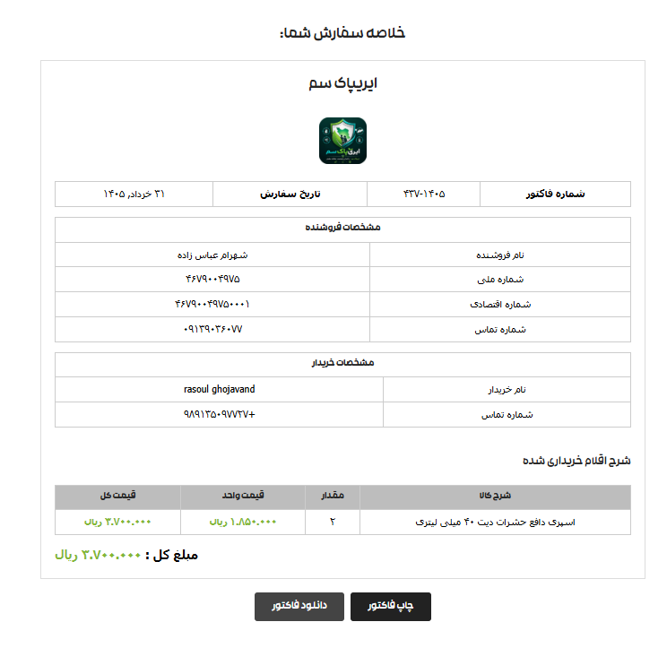
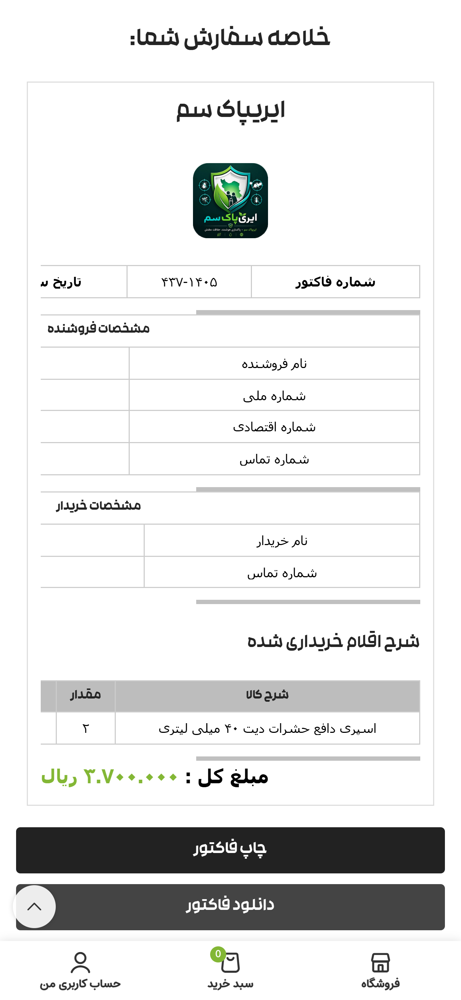

# WP Clean Invoice Generator
# افزونه صدور فاکتور ووکامرس وردپرس

A lightweight WordPress plugin that generates clean and simple invoices.

---

## English

### Features
- Clean and professional invoice layout
- Lightweight and fast
- Easy integration with WordPress
- Printable invoices
- Mobile friendly

### Installation
1. Download or clone this repository.
2. Upload the plugin folder to `/wp-content/plugins/`.
3. Go to **WordPress Admin → Plugins** and activate **WP Clean Invoice Generator**.
4. Create a new page.
5. Set the page **slug** to `order-summary` (The slug is important, not the page title).
6. Copy the shortcode `[woo_invoice_table]` and paste it into that page.

### Usage
After activating the plugin, you will have a clean invoice instead of the standard thank you page. You can also print or download the invoice directly from the page.

### Screenshots

---

## فارسی (Persian)

### ویژگی‌ها
- قالب فاکتور تمیز و حرفه‌ای
- سبک و سریع
- ادغام آسان با وردپرس
- قابلیت پرینت فاکتور
- واکنش‌گرا (سازگار با موبایل)

### نصب و راه‌اندازی
۱. این مخزن را دانلود یا کلون کنید.
۲. پوشه پلاگین را در مسیر `/wp-content/plugins/` سایت خود آپلود کنید.
۳. به بخش **پیشخوان وردپرس > افزونه‌ها** بروید و **WP Clean Invoice Generator** را فعال کنید.
۴. یک برگه جدید بسازید.
۵. نامک (Slug) برگه را دقیقاً روی `order-summary` تنظیم کنید (نام برگه مهم نیست، نامک اهمیت دارد).
۶. کد کوتاه `[woo_invoice_table]` را در برگه قرار دهید.

### نحوه استفاده
پس از فعال‌سازی، به جای صفحه "تشکر از خرید" پیش‌فرض وردپرس، فاکتور تمیز شما نمایش داده می‌شود. همچنین کاربر می‌تواند فاکتور را مشاهده، دانلود یا پرینت کند.

---

## Requirements
- WordPress 5.0+
- PHP 7.2+

## License
MIT License
